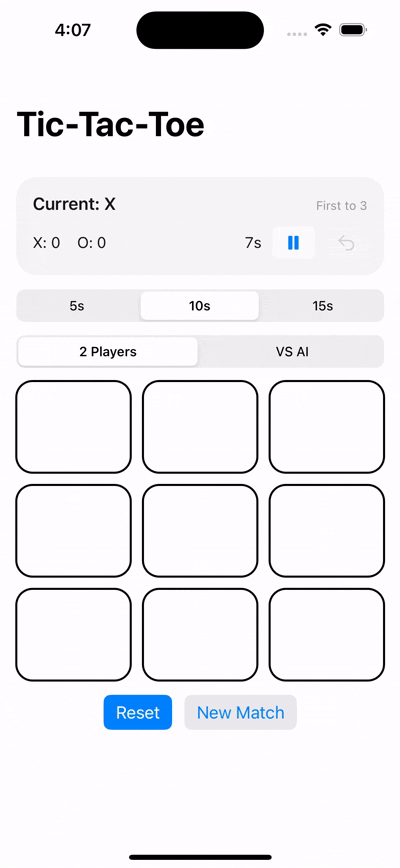

# TicTacToe Hot-Seat (SwiftUI)

A simple Tic-Tac-Toe (3x3) iOS app built with SwiftUI, featuring multiple AI difficulty levels including an unbeatable Minimax AI.

## 🚀 Features

### 🎮 Core Gameplay
- 3x3 board (X / O turns)
- Win & draw detection
- Highlight winning line
- First-to-N match mode
- Score tracking (X / O)
- Game over & match over alerts

### ⏱ Move Timer
- Hot-seat timer
- Selectable time limit (5s / 10s / 15s)
- Pause / resume
- Timer resets on move / undo
- Extracted `GameClock` abstraction

### 🤖 AI Modes
- **Random** – chooses random empty cell
- **Smart** – blocks opponent & plays winning moves
- **Minimax (Unbeatable)** – optimal game tree search
    - Never loses
    - Always finds winning path if available
AI strategies are fully separated from the engine via the `AIStrategy` abstraction.

### ↩ Undo (AI-aware)
- Undo last move
- In VS AI mode: reverts both player and AI move
- Cancels scheduled AI work
- Resets timer state correctly

### 🧠 Architecture
- `TicTacToeCore` – pure game logic  
- `TicTacToeEngine` – `ObservableObject` wrapper  
- Snapshot pattern – UI reads immutable state  
- AI strategies (`Random`, `SmartBlockWin`, `Minimax`) – pluggable via protocol  

### ✨ UX Enhancements
- Ghost move preview (press & hold)
- Disabled board when not playable
- Clean match state transitions
- Single source of truth configuration (GameConfig)

## 🛠 Tech stack
- Swift
- SwiftUI
- ObservableObject (`@StateObject`, `@Published`)
- XCTest

## ▶️ How to run
1. Open the project in Xcode
2. Select an iOS Simulator
3. Run (`Cmd + R`)

## 🧪 Tests
Unit tests cover:
- Move validation
- Win detection
- Match completion
- Timer behavior
- AI logic (random + smart)
- Delayed AI scheduling
- Cancellation of pending AI
- Undo (human + AI mode)
Run unit tests:
- `Cmd + U`
